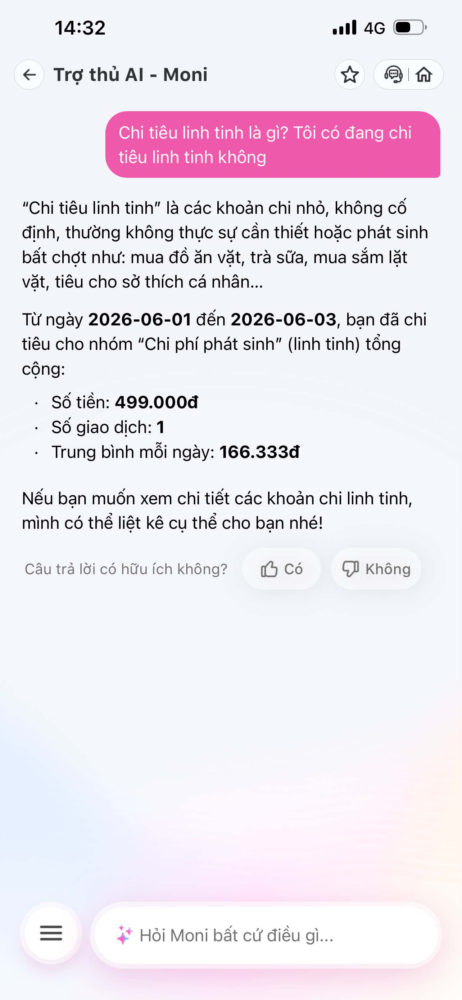
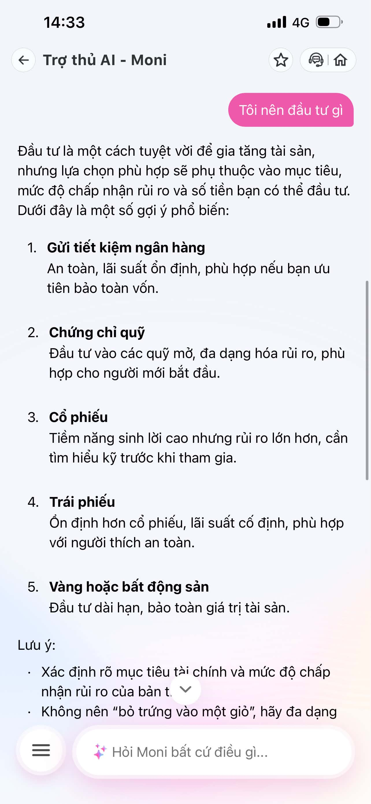
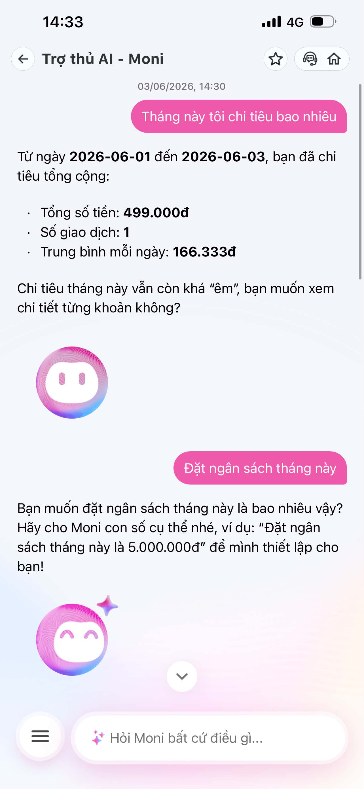

# Finding Note — MoMo Moni Chatbot

**Sản phẩm:** MoMo — Moni (Trợ thủ AI)  
**Ngày dùng thử:** 2026-06-03  
**Evidence:** 3 screenshots

| | | |
|---|---|---|
|  |  |  |
| Intent mơ hồ | Failure: tư vấn generic | Happy path |

---

## 1. Promise vs Reality

**Product hứa gì?**  
Moni được giới thiệu là "Trợ thủ tài chính cá nhân" — phân tích chi tiêu, tư vấn tài chính dựa trên dữ liệu thực của user trong ví MoMo.

**User được hứa sẽ được giúp:**  
Người dùng cá nhân muốn hiểu và kiểm soát chi tiêu hàng ngày.

**Kỳ vọng AI làm được:**
- Trả lời câu hỏi về số liệu chi tiêu (bao nhiêu, nhóm nào, so sánh tháng)
- Nhận ra intent mơ hồ và hỏi lại để làm rõ
- Tư vấn dựa trên dữ liệu thực của user, không phải lý thuyết chung

**Điểm gãy quan sát được:**

| # | Input thử | Phản ứng của Moni | Điểm gãy |
|---|---|---|---|
| 1 | "Tháng này tôi chi tiêu bao nhiêu" | Trả lời đúng số liệu, hỏi lại khi user muốn đặt ngân sách | Không có điểm gãy — happy path |
| 2 | "Chi tiêu linh tinh là gì? Tôi có đang chi tiêu linh tinh không" | Định nghĩa thuật ngữ + show số tổng, nhưng không đánh giá mức độ cao/thấp | Không nhận ra 2 câu hỏi khác nhau; thiếu ngưỡng so sánh |
| 3 | "Tôi nên đầu tư gì" | Liệt kê 5 hình thức đầu tư generic (tiết kiệm, cổ phiếu, vàng...) | Không dùng data thực của user; không giới hạn scope |

---

## 2. Bốn Paths

### Happy Path ✓
**Screenshot:**   
**Trigger:** "Tháng này tôi chi tiêu bao nhiêu"  
**Hành vi:** Moni pull đúng data từ 2026-06-01 đến 2026-06-03: tổng 499,000đ, 1 giao dịch, trung bình 166,333đ/ngày. Khi user tiếp tục "Đặt ngân sách tháng này", Moni hỏi lại con số cụ thể với ví dụ rõ ràng.  
**Kết luận:** Path này hoạt động tốt. AI có data và dùng đúng.

### Low-Confidence Path ⚠️ (một phần)
**Screenshot:**  (phần đặt ngân sách)  
**Trigger:** "Đặt ngân sách tháng này" (không có số cụ thể)  
**Hành vi:** Moni nhận ra thiếu thông tin và hỏi lại: *"Bạn muốn đặt ngân sách tháng này là bao nhiêu vậy?"* kèm ví dụ format.  
**Kết luận:** Low-confidence path xử lý đúng khi thiếu tham số rõ ràng. Tuy nhiên, chưa test được khi AI không chắc về intent phức tạp hơn.

### Failure Path ✗
**Screenshot:**   
**Trigger:** "Tôi nên đầu tư gì"  
**Hành vi:** Moni trả lời bằng danh sách 5 hình thức đầu tư hoàn toàn generic — không tham chiếu đến dữ liệu chi tiêu thực tế của user (dù đang có), không thừa nhận đây nằm ngoài phạm vi phân tích chi tiêu, không redirect sang chuyên gia.  
**Kết luận:** Đây là failure rõ nhất. Product hứa là "trợ thủ cá nhân hóa" nhưng ứng xử như search engine tài chính.

### Correction Path — Chưa có trong product
**Quan sát:**  — có nút "Câu trả lời có hữu ích không? 👍 / 👎" — đây là signal thu thập feedback, nhưng không rõ có được dùng để cá nhân hóa hay học lại không. Không có cơ chế sửa phân loại giao dịch trực tiếp từ chat. Khi user sửa, correction không được log hiển thị hay xác nhận.

---

## 3. Findings Viết Thành Quyết Định Product

### Finding 1 — Tư vấn ngoài phạm vi, không dùng data thực

```
Khi user hỏi "Tôi nên đầu tư gì",
AI trả lời bằng danh sách tư vấn đầu tư generic mà không dùng
dữ liệu chi tiêu thực tế của user và không giới hạn phạm vi năng lực,
hậu quả là user không nhận được tư vấn cá nhân hóa và có thể tin rằng
Moni có năng lực tư vấn đầu tư chuyên sâu trong khi thực tế không phải vậy.
Lỗi thuộc layer: promise (hứa là trợ thủ tài chính cá nhân) + data-tool (có data nhưng không dùng).
Nên sửa bằng: fallback path — Moni nhận diện câu hỏi nằm ngoài vùng phân tích chi tiêu,
trả lời bằng insight từ data user trước ("Với mức chi tiêu hiện tại bạn đang tiết kiệm được ~Xđ/tháng"),
sau đó gợi ý hướng phù hợp với bức tranh tài chính đó, hoặc rõ ràng redirect ra ngoài scope.
```

**Đổi gì trong SPEC:** Thêm intent classifier phân biệt câu hỏi trong scope (phân tích chi tiêu, ngân sách) vs. ngoài scope (tư vấn đầu tư, bảo hiểm). Ngoài scope → dùng data user để contextualize trước khi trả lời chung hoặc từ chối có giải thích.

---

### Finding 2 — Intent mơ hồ: không tách 2 câu hỏi, thiếu ngưỡng so sánh

```
Khi user hỏi "Chi tiêu linh tinh là gì? Tôi có đang chi tiêu linh tinh không",
AI trả lời câu đầu (định nghĩa) và show số liệu tổng hợp,
nhưng không trả lời câu thứ hai (đánh giá mức độ: cao hay thấp so với gì?),
hậu quả là user có data nhưng không biết nên diễn giải nó như thế nào.
Lỗi thuộc layer: intent (không tách 2 intent trong một câu) + UX recovery (thiếu ngưỡng tham chiếu).
Nên sửa bằng: (1) tách multi-intent thành 2 bước trả lời riêng,
(2) thêm ngưỡng so sánh ("cao hơn tháng trước X%" hoặc "chiếm Y% tổng chi tiêu"),
(3) nếu không có ngưỡng → hỏi lại user muốn so sánh với gì.
```

**Đổi gì trong SPEC:** Thêm yêu cầu multi-intent handling và comparative benchmark trong phần phân tích chi tiêu. Khi không có baseline → low-confidence path hỏi lại thay vì trả lời thiếu.

---

## 4. Sketch As-Is / To-Be

### Flow: "Tư vấn đầu tư / câu hỏi ngoài scope"

```
AS-IS (hiện tại)
─────────────────────────────────────────────────
User: "Tôi nên đầu tư gì?"
        │
        ▼
  Moni nhận keyword "đầu tư"
        │
        ▼
  Trả về danh sách generic (5 loại tài sản)
  [KHÔNG dùng data user]
  [KHÔNG xác nhận scope]
        │
        ▼
  User đọc → không liên quan đến tình hình thực → bỏ cuộc
  ⚠ Điểm gãy: mất trust vì câu trả lời không cá nhân hóa

─────────────────────────────────────────────────

TO-BE (đề xuất)
─────────────────────────────────────────────────
User: "Tôi nên đầu tư gì?"
        │
        ▼
  Moni detect: câu hỏi ngoài scope phân tích chi tiêu
        │
        ▼
  Bước 1 — Contextualize bằng data thực:
  "Tháng này bạn chi 499,000đ và còn dư ~Xđ.
   Với mức này, một số hướng phù hợp là..."
        │
        ▼
  Bước 2 — Gợi ý tương ứng với bức tranh tài chính user
  (hoặc rõ ràng: "Để tư vấn đầu tư chi tiết hơn,
   bạn nên gặp chuyên gia tài chính")
        │
        ▼
  User nhận được insight cá nhân hóa → trust tăng
  ✓ Path đã sửa: promise vs reality align
```

---

### Flow: "Phân tích intent mơ hồ"

```
AS-IS (hiện tại)
─────────────────────────────────────────────────
User: "Chi tiêu linh tinh là gì? Tôi có đang chi nhiều không?"
        │
        ▼
  Moni trả lời câu 1 (định nghĩa) + show số tổng
  [KHÔNG tách câu 2 ra]
  [KHÔNG có ngưỡng so sánh]
        │
        ▼
  User thấy số nhưng không biết đánh giá thế nào
  ⚠ Điểm gãy: data hiện diện nhưng không actionable

─────────────────────────────────────────────────

TO-BE (đề xuất)
─────────────────────────────────────────────────
User: "Chi tiêu linh tinh là gì? Tôi có đang chi nhiều không?"
        │
        ▼
  Moni detect 2 intent riêng biệt
        │
        ├──▶ Intent 1: Định nghĩa → trả lời ngắn
        │
        └──▶ Intent 2: Đánh giá mức độ
                │
                ▼
          Có baseline? (data tháng trước / trung bình)
          ├── Có → "Chi linh tinh tháng này = 499,000đ,
          │         cao hơn tháng trước 12%"
          └── Không → low-confidence path:
                      "Bạn muốn so sánh với tháng trước
                       hay với mức trung bình của bạn?"
        │
        ▼
  User nhận được đánh giá có ngưỡng → có thể ra quyết định
  ✓ Path đã sửa: intent được tách, không có blind spot
```

---

## Checklist Tự Kiểm

- [x] Có ít nhất 1 screenshot hoặc observation cụ thể — có 3 screenshots (1.png, 2.png, 3.png)
- [x] Có đủ 4 paths hoặc nói rõ path nào chưa có — đủ 4 paths; Correction path xác nhận chưa có trong product
- [x] Finding được viết thành product decision, không chỉ là nhận xét — có 2 findings theo đúng template
- [x] Sketch có as-is và to-be — có cho 2 flows
- [x] Có một câu nói rõ finding này sẽ đổi gì trong SPEC — mỗi finding có mục "Đổi gì trong SPEC"
